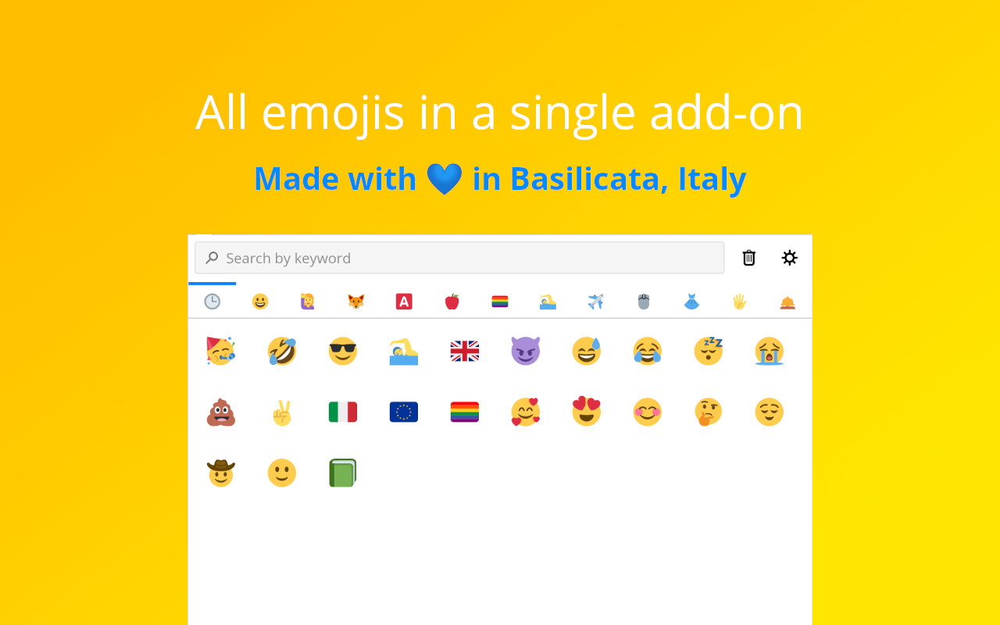
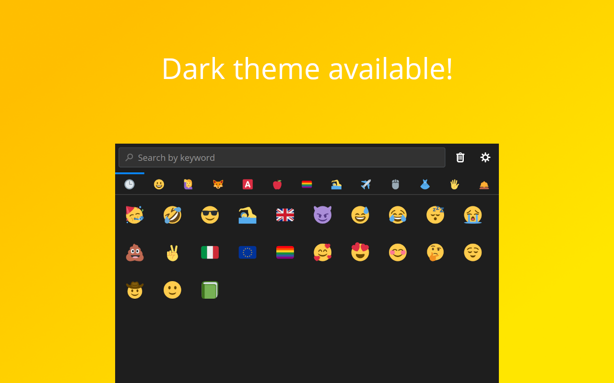
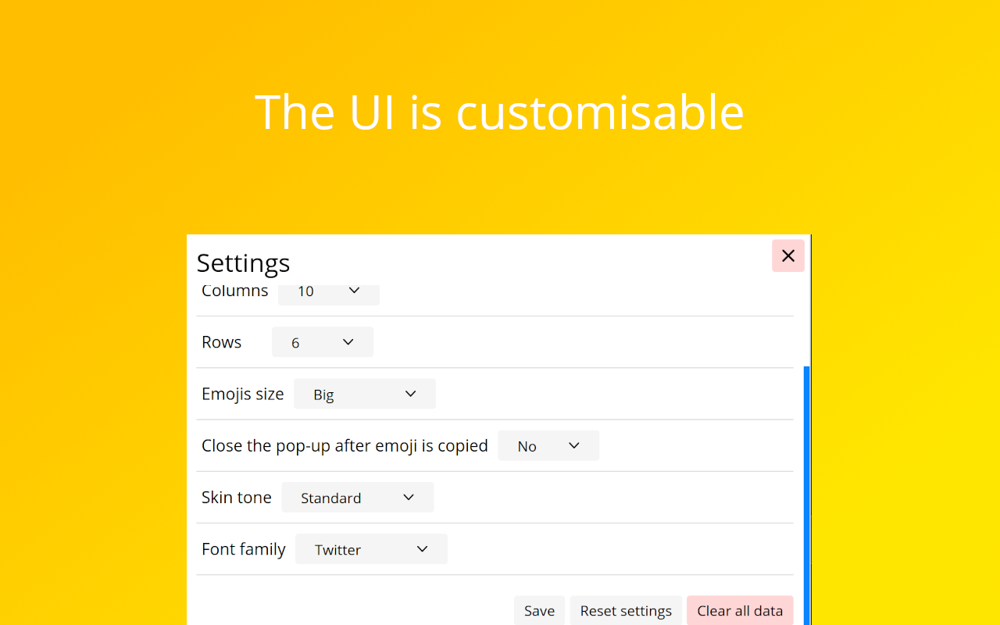

# </img> Emoji
Official repo of https://addons.mozilla.org/it/firefox/addon/emoji-sav/.

  

   

To support me, you can do a donation :smile: with PayPal or Ko-fi:

[</img>](https://bit.ly/3aJnnq7) [</img>](https://ko-fi.com/R5R31UQ8G)

## Description

This extension permits you to copy an emoji in the clipboard. There are many emojis, exactly **1703**!

Emojis are divided in some sections, to help you to find the correct emoji quickly (in order):

- Smileys (102 emojis)
- People (169 emojis)
- Animals (128 emojis)
- Symbols (280 emojis)
- Foods and drinks (120 emojis)
- Flags (269 emojis)
- Sports and everything related to them (74 emojis)
- Travel and places (105 emojis)
- Technologies and office (91 emojis)
- Clothes and accessories (46 emojis)
- Hands and parts of body (46 emojis)
- Other (“not categorised”) (273 emojis)

## Features

- Search-box: so you find easily emoji by keywords
- Most used emojis: in the first tab you can find the emoji you use more
- Clear, modern and customisable UI
- Simplicity: with a single click you can copy an emoji
- Short-cut: open the add-on with `Ctrl`/`Cmd`+`Alt`+`A`
- Tooltip: every emoji has the tooltip, so you can learn what's the name of an emoji

## How to contribute

You can open an `Issue` and there you must describe the feedback, the bug or the new feature you want.

## Screenshots

See folder <code>screenshots</code> to see screenshots also of the older versions.

</img> </img> </img> </img>

## License
