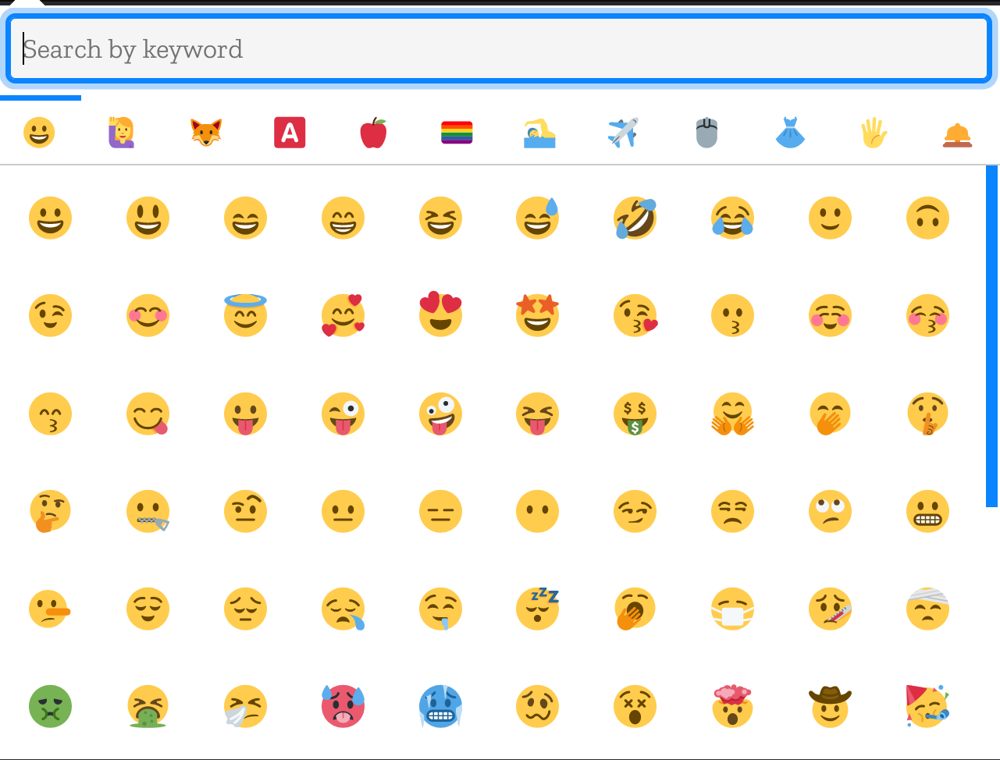
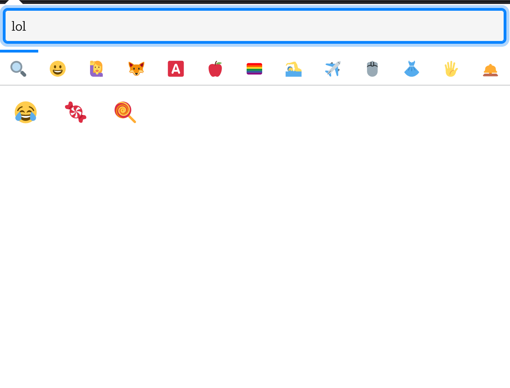

# </img> Emoji
Official repo of https://addons.mozilla.org/it/firefox/addon/emoji-sav/.

  

   

To support me, you can do a donation :smile: with PayPal or Ko-fi:

[</img>](https://bit.ly/3aJnnq7) [</img>](https://ko-fi.com/R5R31UQ8G)

## Description

This extension permits you to copy an emoji in the clipboard. There are many emojis, exactly 1179!

Emojis are divided in some sections, to help you to find the correct emoji quickly (in order):

- Smileys (100 emojis)
- People (160 emojis)
- Animals (111 emojis)
- Symbols (176 emojis)
- Foods and drinks (105 emojis)
- Flags (61 emojis)
- Sports and everything related to them (57 emojis)
- Travel and places (100 emojis)
- Technologies and office (85 emojis)
- Clothes and accessories (34 emojis)
- Hands (42 emojis)
- Other (“not categorised”) (148 emojis)

## How to contribute

You can open an issue and there you must describe the feedback, the bug or the new feature you want.

## Screenshots

See folder <code>screenshots</code> to see screenshots also of the older versions.

</img>

</img>

## License
