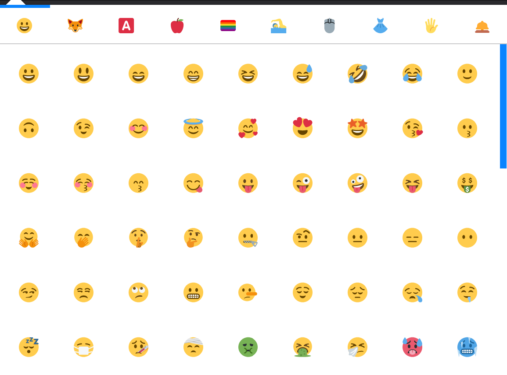
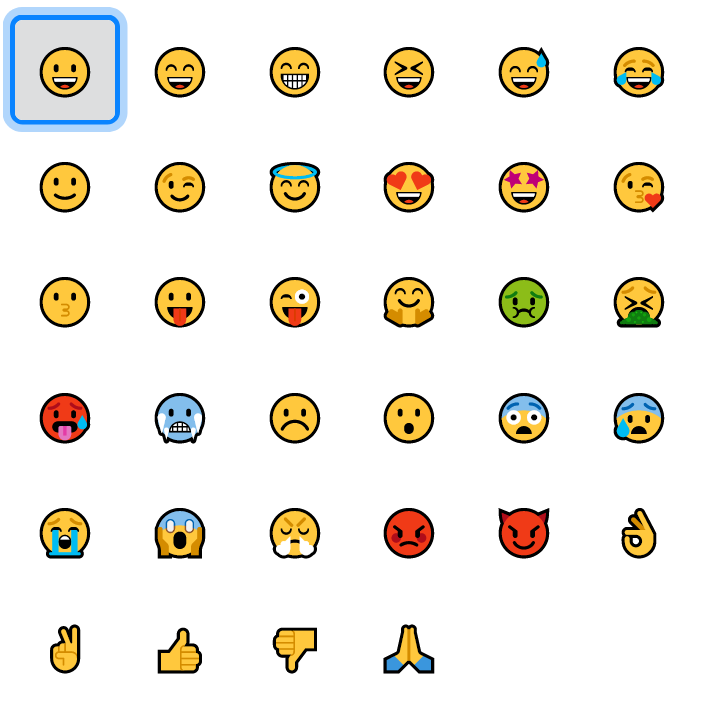

# </img> Emoji
Official repo of https://addons.mozilla.org/it/firefox/addon/emoji-sav/.

  

  

## Description

This extension permits you to copy an emoji in the clipboard. There are many emojis, exactly 905!

Emojis are divided in some sections, to help you to find the correct emoji quickly (in order):

- Smileys (132 emojis)
- Animals (111 emojis)
- Symbols (162 emojis)
- Foods and drinks (105 emojis)
- Flags (62 emojis)
- Sports and everything related to them (53 emojis)
- Technologies and office (68 emojis)
- Clothes and accessories (34 emojis)
- Hands (41 emojis)
- Other (“not categorised”) (137 emojis)

## How to contribute

You can open an issue and there you must describe the feedback, the bug or the new feature you want.

## Screenshots

New UI:

(old) UI:

