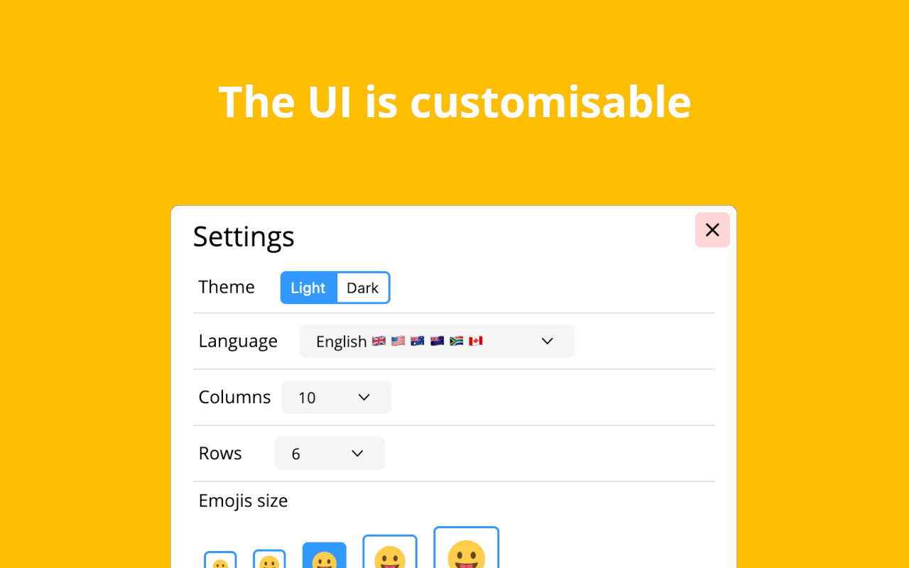

<h1 align="center">
    <br>
    
    <br>
</h1>

Official website: https://emojiaddon.com.

Official repo of https://addons.mozilla.org/firefox/addon/emoji-sav/.

[](https://github.com/Sav22999/emoji/releases/) [](https://github.com/Sav22999/emoji/blob/master/LICENSE) 
[](https://app.fossa.io/projects/git%2Bgithub.com%2FSav22999%2Femoji?ref=badge_shield)

[](https://addons.mozilla.org/firefox/addon/emoji-sav/) [](https://chrome.google.com/webstore/detail/emoji/kjepehkgbooeigeflhiogplnckadlife) [](https://microsoftedge.microsoft.com/addons/detail/emoji/ejcgfbaipbelddlbokgcfajefbnnagfm)

To support me, you can do a donation :smile: with **PayPal** or **LiberaPay**:

<a href="https://liberapay.com/Sav22999/donate"></a> [</img>](https://paypal.me/saveriomorelli)

## Description

This extension permits you to copy an emoji in the clipboard. There are many emojis, more than **1703**!

Emojis are divided in some sections, to help you find the correct emoji quickly (in order):

- Smileys
- People
- Animals
- Symbols
- Foods and drinks
- Flags
- Sports and everything related to them
- Travel and places
- Technologies and office
- Clothes and accessories
- Hands and parts of body
- Other (“not categorised”)

## Features

- Search-box: so you find easily emoji by keywords, by colours (```:red:```, ```:purple:```, ```:pink:```, ```:transparent:```, ```:yellow:```, ```:gold:```, ```:orange:```, ```:black:```, ```:white:```, ```:green:```, ```:blue:``` and ```:grey:``` / ```:gray:```) or by gender (```:man:```, ```:woman:```, ```:person:```)
- Most used emojis: in the first tab you can find the emoji you use more
- Clear, modern and customisable UI
- Simplicity: with a single click you can copy an emoji
- Shortcut: open the add-on with `Ctrl`/`Cmd`+`Alt`+`A` (you can customise this in Settings)
- Tooltip: every emoji has the tooltip, so you can learn what's the name of an emoji
- Skin-tone of emojis
- Inserting directly on the website (not only copy it): enable this in Settings

## How to contribute

You can open an `Issue` and there you must describe the feedback, the bug or the new feature you want.

Also, you can translate the extension (and the emojis description as well) on [Crowdin](https://crowdin.com/project/emoji-sav) easily and freely.

## Screenshots

See folder <code>screenshots</code> to see screenshots also of the older versions.

</img> </img> </img> </img>

## License
[](https://app.fossa.io/projects/git%2Bgithub.com%2FSav22999%2Femoji?ref=badge_large)
